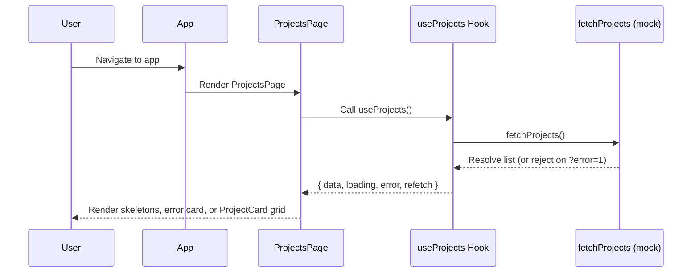

# Architecture — User Projects Frontend

## System Overview
The User Projects Frontend is a Create React App (CRA) based UI that renders a list of projects belonging to the authenticated user. It uses a mock authentication context and a mock projects service to simulate a backend. The Ocean Professional theme guides the visual design: clean, modern, with blue primary accents, rounded corners, subtle shadows, and gradients.

## Containers and Dependencies
- Frontend container: user_projects_frontend (React + CRA)
- External dependency reference: user_projects_db (project-level dependency placeholder; no direct connection in this repo)
- No backend service exists in this repository; all project data is mocked client-side.

## Application Architecture
- App composition
  - AuthProvider (mock user provider)
  - Navbar (top)
  - ProjectsPage (main content)
- Data layer
  - services/projects.js exports:
    - fetchProjects(): simulates async data retrieval (supports error simulation via ?error=1)
    - useProjects(): React hook returning { data, loading, error, refetch }

Key modules:
- src/App.js: Root composition (AuthProvider -> Navbar + ProjectsPage)
- src/context/AuthContext.jsx: Mock authentication context (user object)
- src/services/projects.js: Sample data + data-fetch hook
- src/pages/ProjectsPage.jsx: Fetching, responsive grid rendering, error/empty/loading states
- src/components/Navbar.jsx: Title and user initials avatar
- src/components/ProjectCard.jsx: Displays project details and status badge
- src/index.css: Design tokens and component utility classes

## Component Responsibilities
- App: Root layout and providers; sets main container.
- Navbar: Shows app title and the authenticated user’s name/initials.
- ProjectsPage: Fetches data, renders different UI states, and orchestrates the responsive grid.
- ProjectCard: Presents project info with standardized badges and updated date.
- AuthProvider/useAuth: Supplies mock user data globally.

## Data Flow


## Data Model
Project (UI-level):
- id: string
- name: string
- description: string
- updatedAt: number (epoch ms)
- status: "Active" | "Paused" | "Archived"

AuthContext User:
- id: string
- name: string
- email: string

## Styling System
- Tokens in src/index.css:
  - Colors: primary, secondary, success, error, background, surface, text
  - Radii, shadows, focus ring
- Utility classes:
  - .badge and variants (.badge--active, .badge--paused, .badge--archived)
  - .card, .skeleton, animation keyframes

Note: src/styles/theme.css also defines duplicated tokens. Consolidation is recommended to ensure one source of truth (prefer index.css).

## Error Handling and Loading
- Loading: ProjectsPage shows skeleton card placeholders.
- Error: An alert-styled card displays the error and a Try again button that calls refetch.
- Empty: A clearly worded card indicates no projects are available.

## Authentication and Authorization
- Current: Mock AuthContext with static user.
- Future: Replace with real identity provider (OIDC/OAuth). Use secure token handling (HttpOnly cookies or in-memory tokens) and enforce backend authorization. UI should render only permitted features (e.g., creation button gated by role).

## Audit and GxP Strategy
- Current scope is read-only; therefore, audit trail persistence on the server is not implemented.
- Strategy for future:
  - For READ: Server logs who accessed which project list and when (userId, timestamp ISO 8601, resource, parameters, result count).
  - For WRITE (future): Server logs before/after states, reason for change, and user identity; UI can capture intent and pass metadata.
- Electronic signature is not required for read-only operations. If future modal supports modifications, electronic signature requirements must be added.

## Security and Privacy
- No secrets or tokens stored in this repo. For API integration:
  - Use REACT_APP_API_BASE_URL for configuration.
  - Avoid exposing credentials in client-side code.
  - Validate and sanitize incoming data before render.

## Performance Considerations
- Lightweight rendering with functional components and hooks.
- Skeleton UI ensures perceived performance.
- Responsive grid uses width-based logic to adjust columns (1–3) on resize.

## Testing Approach
- Unit Tests:
  - ProjectCard: renders fields, applies correct badge classes.
  - ProjectsPage: loading, empty, success, error+retry behaviors.
- Integration Tests (future):
  - With real API, test auth flow, data fetching, and server-side audit logging.
- Validation Tests:
  - Data contract adherence when integrating backend.

## Deployment and Environment
- CRA-based scripts (start/build/test).
- No required environment variables in mock mode.
- Future .env recommendation: REACT_APP_API_BASE_URL.

## Release Gates and Quality
- Accessibility verification.
- Unit tests passing with target coverage.
- Error and empty states verified.
- Compliance documentation for ALCOA+ mapping and audit strategy included.
- Style adherence to Ocean Professional theme.

## Future Enhancements
- Real API client module (using REACT_APP_API_BASE_URL).
- Real authentication and authorization with role gates.
- Project detail modal implementation.
- Theme token consolidation and CSS refactoring for reusability.
- Routing support for dedicated detail pages.

``` 
Sources:
- user_projects_frontend/src/App.js
- user_projects_frontend/src/context/AuthContext.jsx
- user_projects_frontend/src/services/projects.js
- user_projects_frontend/src/pages/ProjectsPage.jsx
- user_projects_frontend/src/components/Navbar.jsx
- user_projects_frontend/src/components/ProjectCard.jsx
- user_projects_frontend/src/index.css
- user_projects_frontend/ARCHITECTURE.md
```
