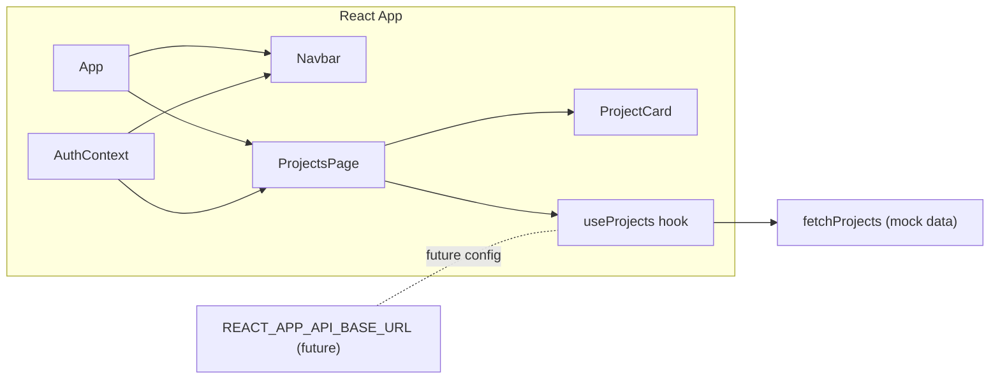

# Architecture — User Projects Frontend

## System Overview
The application is a Create React App (CRA)–based UI that lists projects belonging to the authenticated user. It uses a mock authentication context and a mock projects service to simulate a backend. The Ocean Professional theme guides the visual design with blue primary accents, rounded corners, subtle shadows, and gradients.

## Containers and Dependencies
- Frontend container: user_projects_frontend (React + CRA)
- External dependency reference: user_projects_db (placeholder; no direct connection in this repo)
- No backend service exists in this repository; project data is mocked client-side.

## Application Architecture
- App composition
  - AuthProvider (mock user provider)
  - Navbar (top)
  - ProjectsPage (main content)
- Data layer
  - services/projects.js
    - fetchProjects(): simulates async data retrieval (supports error simulation via ?error=1)
    - useProjects(): React hook returning { data, loading, error, refetch }

Key modules:
- src/App.js: Root composition (AuthProvider → Navbar + ProjectsPage)
- src/context/AuthContext.jsx: Mock authentication context (user object)
- src/services/projects.js: Sample data + data-fetch hook
- src/pages/ProjectsPage.jsx: Data fetch, responsive grid rendering, error/empty/loading states
- src/components/Navbar.jsx: Title and user initials avatar
- src/components/ProjectCard.jsx: Project details and status badge
- src/index.css: Design tokens and utility classes

## Architecture Diagram

## Data Model
- Project (UI-level):
  - id: string
  - name: string
  - description: string
  - updatedAt: number (epoch ms)
  - status: "Active" | "Paused" | "Archived"
- AuthContext User:
  - id: string
  - name: string
  - email: string

## Styling System
- Tokens in src/index.css:
  - Colors: primary, secondary, success, error, background, surface, text
  - Radii, shadows, focus ring
- Utility classes:
  - .badge and variants (.badge--active, .badge--paused, .badge--archived)
  - .card, .skeleton, animation keyframes
- Note: src/styles/theme.css also defines duplicated tokens; consolidation into a single source (prefer index.css) is recommended.

## Error Handling and Loading
- Loading: ProjectsPage shows skeleton card placeholders until data resolves.
- Error: An alert-styled card displays error details and a Try again button that calls refetch.
- Empty: A clearly worded card indicates no projects are available.

## Authentication and Authorization
- Current: Mock AuthContext with static user.
- Future: Replace with real identity provider (OIDC/OAuth). Use secure token handling (HttpOnly cookies or in-memory tokens) and enforce backend authorization. Conditionally render features based on role/permissions.

## Compliance and GxP Strategy
- Read-only scope; no server-side audit trail implementation within this repo.
- Future READ logging (server): capture userId, ISO 8601 timestamp, resource, parameters, and result count.
- Future WRITE operations (not in scope): capture before/after state, reason for change, user identity; consider electronic signatures for GxP-critical steps.

## Security and Privacy
- No secrets or tokens are stored.
- Future API integration should:
  - Use REACT_APP_API_BASE_URL for configuration.
  - Avoid exposing credentials; prefer secure cookie sessions or in-memory tokens.
  - Validate and sanitize all payloads rendered by the UI.

## Performance and Observability
- Lightweight functional components and hooks minimize overhead.
- Skeleton UI improves perceived performance.
- Responsive grid adjusts based on container width.
- Observability (future): correlate client telemetry with server-side audit logs for READ events.

## Testing Approach
- Unit tests:
  - ProjectCard: fields rendering and badge classes.
  - ProjectsPage: loading, empty, success, error+retry behaviors.
  - App: heading presence verification.
- Integration tests (future):
  - Auth flow, data fetching from real API, server-side audit logging.
- Validation tests:
  - Data contract adherence on API integration.

## Deployment and Environment
- CRA-based scripts (start/build/test).
- No required environment variables in mock mode.
- Future .env recommendation: REACT_APP_API_BASE_URL.

## Release Gates and Quality
- Accessibility verification (focus-visible, roles and ARIA).
- Unit tests passing with target coverage (≥80% for in-scope modules).
- Error and empty states verified.
- Compliance documentation for ALCOA+ mapping and audit strategy included.
- Style adherence to Ocean Professional theme.

## Open Risks and Follow-ups
- Token duplication across index.css and styles/theme.css may lead to inconsistencies; consolidation recommended.
- Concrete API spec and auth provider selection pending; integration plan will adjust accordingly.

## Future Enhancements
- Real API client module using REACT_APP_API_BASE_URL.
- Real authentication with role-based UI gating.
- Project detail view (modal or route).
- Token consolidation and CSS refactoring for reusability.
- Routing support for dedicated detail pages.

Sources:
- user_projects_frontend/src/App.js
- user_projects_frontend/src/context/AuthContext.jsx
- user_projects_frontend/src/services/projects.js
- user_projects_frontend/src/pages/ProjectsPage.jsx
- user_projects_frontend/src/components/Navbar.jsx
- user_projects_frontend/src/components/ProjectCard.jsx
- user_projects_frontend/src/index.css
- user_projects_frontend/ARCHITECTURE.md
- user_projects_frontend/README.md
