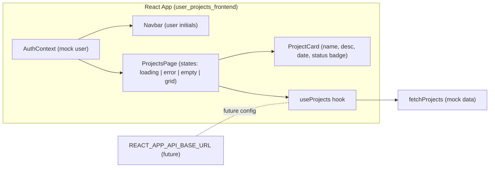

# Product Requirements Document (PRD) — User Projects Frontend

## Executive Summary
The User Projects Frontend is a React web application that displays a list of projects for the authenticated user. The current implementation uses a mock authentication context and a mock projects service to simulate a backend. This PRD formalizes product requirements, acceptance criteria, GxP mapping, testing strategy, and release gates for the user-facing functionality to list projects. It aligns with the Ocean Professional theme and incorporates audit, validation, and access control requirements suitable for a read-only listing feature. Electronic signatures are out of scope for this read-only release.

## Goals and Non-Goals
### Goals
- Present a responsive grid/list of the authenticated user’s projects.
- Support clear loading, error, and empty states.
- Display key attributes for each project: name, description, last updated, and status with badges (Active, Paused, Archived).
- Ensure alignment with GxP ALCOA+ principles for read-only operations (primarily READ audit visibility and access control).
- Provide a scalable pattern for migrating to a real API (using REACT_APP_API_BASE_URL) and real authentication.

### Non-Goals
- Creating or editing projects (no CREATE/UPDATE/DELETE operations in this scope).
- Implementing a real authentication or identity provider; current scope uses mock auth.
- Implementing server-side audit persistence; the current scope documents audit strategy for future implementation.
- Implementing electronic signature capture; not required for read-only listing.

## User Stories and Acceptance Criteria
- REQ-US-1: As an authenticated user, I want to see “Your Projects” so I can view my projects at a glance.
  - AC-1.1: A heading “Your Projects” is visible above the grid.
  - AC-1.2: A descriptive subtext/tagline is shown under the heading.
- REQ-US-2: As a user, I want to see a loading state while projects are fetched to understand the system is working.
  - AC-2.1: Skeleton cards render while loading is true.
  - AC-2.2: Skeletons are replaced by content or empty/error states when loading completes.
- REQ-US-3: As a user, I want to see a friendly message if an error occurs and a retry control to recover.
  - AC-3.1: An alert-styled card appears with a descriptive message on error.
  - AC-3.2: A “Try again” button is provided and triggers refetch.
- REQ-US-4: As a user, I want a clear “No projects yet” empty state to understand that I have no projects.
  - AC-4.1: When data is empty and not loading, an empty state card is shown.
  - AC-4.2: The empty state card provides guidance text.
- REQ-US-5: As a user, I want to view key information (name, description, updated date, status) on each project card.
  - AC-5.1: Each card shows name, description, updated date, and status badge.
  - AC-5.2: Status badge visually distinguishes Active, Paused, and Archived.
- REQ-US-6: As a user, I want consistent styling and accessible UI aligned to the Ocean Professional theme.
  - AC-6.1: Focus-visible outlines are present for interactive controls.
  - AC-6.2: Badge and card styles use the provided tokens and meet contrast guidelines.
- REQ-US-7 (Future): As a user, I want to open a project details view.
  - AC-7.1: Not implemented in this release; will be addressed in a future iteration.

## Functional Requirements
- FR-1: Display heading “Your Projects” and a subtext tagline.
- FR-2: Fetch projects on page load using the data-fetch hook (useProjects) and render a responsive grid of ProjectCard components.
- FR-3: Show loading skeleton cards while data is being fetched.
- FR-4: On error, show an error alert card with error text and “Try again” button that refetches.
- FR-5: On empty data, show an empty state card with guidance text.
- FR-6: Each ProjectCard shows name, description, updated date, and a status badge with visual distinction.
- FR-7: Navbar displays the application title and user initials from AuthContext.
- FR-8 (Future): Project details view (modal or page) is defined but not implemented.

## Non-Functional Requirements
- NFR-1: Accessibility: Use semantic roles, focus-visible outlines, and legible color contrast (WCAG AA).
- NFR-2: Performance: Initial render under 2s on broadband; indicate progress with skeletons.
- NFR-3: Reliability: Gracefully handle network errors (simulated via ?error=1).
- NFR-4: Maintainability: Functional components with hooks; modularized components and styles.
- NFR-5: Security: Do not expose secrets; future integration will use environment variables (REACT_APP_API_BASE_URL).

## Requirements Traceability (REQ IDs)
- REQ-US-1 → src/pages/ProjectsPage.jsx (heading) → Tests: ProjectsPage.test.jsx (success state) and App.test.js (heading present).
- REQ-US-2 → src/pages/ProjectsPage.jsx (skeletons) → Tests: ProjectsPage.test.jsx (“shows loading skeletons”).
- REQ-US-3 → src/pages/ProjectsPage.jsx (alert + retry) → Tests: ProjectsPage.test.jsx (“error state and retry”).
- REQ-US-4 → src/pages/ProjectsPage.jsx (empty card) → Tests: ProjectsPage.test.jsx (“renders empty state”).
- REQ-US-5 → src/components/ProjectCard.jsx (content + badges) → Tests: ProjectCard.test.jsx.
- REQ-US-6 → src/components/Navbar.jsx + global styles → Visual verification and automated checks.
- REQ-US-7 (Future) → Planned; not implemented.

## Compliance (GxP ALCOA+, Audit Trail, Access Controls)
- ALCOA+ Mapping
  - Attributable: AuthContext provides user identity; future API should bind READ operations to server logs.
  - Legible: Clear separation of concerns and component naming; documentation provided here.
  - Contemporaneous: Future API to log READ access at request time with ISO 8601 timestamps.
  - Original: Data originates from services/projects.js in mock mode; real API will be the original source.
  - Accurate: UI renders fields without transformation that would change meaning; validation planned at integration.
  - Complete: All returned items rendered; empty state explicit when none exist.
  - Consistent: Standardized badge and card styles and statuses; hook enforces consistent loading/error handling.
  - Enduring: No persistence in read-only UI; future server audit storage required for durability and retention.
  - Available: Conceptually gated to authenticated users; future role-based access to be enforced server-side.
- Audit Trail Strategy (Read-only now; future-ready)
  - Client may emit telemetry for READ attempts; authoritative audit trail to be logged on the server.
  - For future WRITE operations: capture user ID, timestamp, before/after values, reason for change; signature if GxP-critical.
- Access Controls
  - Present: Mock authenticated user; no role checks enforced in UI.
  - Future: Role-based authorization and least privilege, with UI conditional rendering based on backend claims.

## Data Model (Conceptual)
- Project
  - id: string
  - name: string
  - description: string
  - updatedAt: number (epoch ms)
  - status: “Active” | “Paused” | “Archived”
- User (AuthContext)
  - id: string
  - name: string
  - email: string

## System Architecture

## Component Responsibilities
- App: Root layout and providers.
- Navbar: Shows app title and user initials avatar.
- ProjectsPage: Orchestrates data fetch, renders states and responsive grid, provides retry on error.
- ProjectCard: Displays project details and status badge with consistent styling.
- AuthProvider/useAuth: Supplies mock user identity.

## Error Handling Strategy
- Loading states display skeleton cards to maintain perceived performance.
- Error state renders an accessible alert card with a clear message and a retry action.
- Safe defaults are used on failure (empty array) to avoid crashes.

## Security and Privacy
- No secrets stored in the repo; mock data only.
- Future: configure API base via REACT_APP_API_BASE_URL and use secure token handling (prefer HttpOnly cookies or in-memory tokens).
- Sanitize and validate data before rendering; avoid dangerous HTML.

## Performance and Observability
- Lightweight functional components; limited re-render scope.
- Observability (future): integrate client metrics and correlate with server logs for READ operations.

## Testing Strategy (unit/integration/validation)
- Unit tests target:
  - ProjectCard: content rendering and badge classes.
  - ProjectsPage: loading, empty, success, error + retry.
  - App: heading presence to reflect end-to-end render path.
- Integration tests (future with API):
  - Authentication flows, API fetch, server audit logging.
- Validation tests:
  - Data contract validation when API integration is added.
- Coverage target: ≥80% for in-scope modules.

## Release Gate Checklist
- [ ] Functional acceptance criteria satisfied (REQ-US-1…6).
- [ ] Accessibility checks (roles, focus-visible, ARIA where applicable) pass.
- [ ] Unit tests pass with ≥80% coverage for modules in scope.
- [ ] Error handling verified (including retry path).
- [ ] Ocean Professional theme adherence verified.
- [ ] Security review complete (no secrets; future env var scheme documented).
- [ ] GxP review: ALCOA+ mapping, audit strategy, and access control strategy documented.

## Open Questions and Risks
- Will a real identity provider be integrated in the near term, and which token model will be used (cookie vs bearer)?
- What server-side retention policy and storage system will be used for audit logs?
- Risk: Theme token duplication between index.css and styles/theme.css can cause divergence; consolidation recommended.

## Roadmap and Future Work
- Real API integration using REACT_APP_API_BASE_URL.
- Replace mock auth with an OIDC/OAuth provider; implement role-based UI.
- Add project details view (modal or routed page).
- Consolidate design tokens into a single source of truth.
- Expand test coverage and add CI (lint, test, build) and pre-commit hooks.

## References
- Components: src/components/Navbar.jsx, src/components/ProjectCard.jsx
- Page: src/pages/ProjectsPage.jsx
- Data layer: src/services/projects.js
- Auth: src/context/AuthContext.jsx
- Styles: src/index.css
- Repository: user_projects_frontend/README.md, ARCHITECTURE.md

Sources:
- user_projects_frontend/src/pages/ProjectsPage.jsx
- user_projects_frontend/src/components/ProjectCard.jsx
- user_projects_frontend/src/components/Navbar.jsx
- user_projects_frontend/src/services/projects.js
- user_projects_frontend/src/context/AuthContext.jsx
- user_projects_frontend/src/index.css
- user_projects_frontend/ARCHITECTURE.md
- user_projects_frontend/README.md
