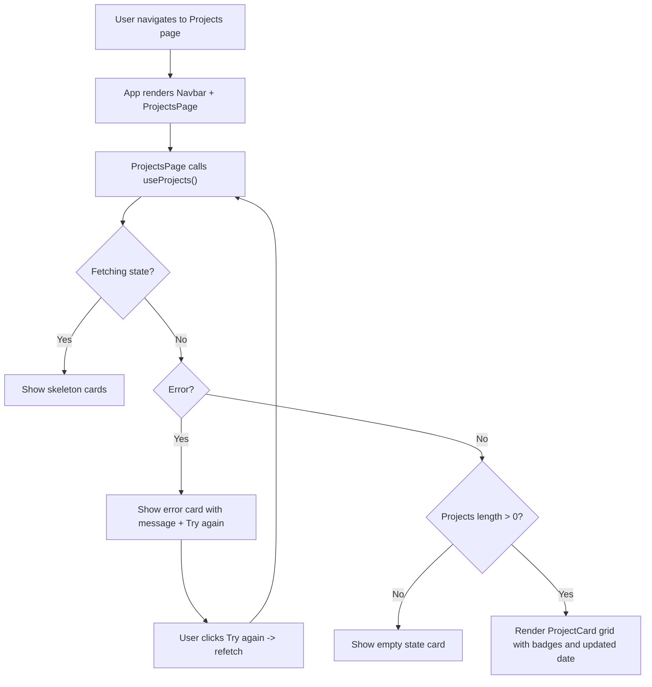

# Product Requirements Document (PRD) — User Projects Frontend

## Executive Summary
The User Projects Frontend is a React web application that displays a list of projects for the authenticated user. The current implementation uses a mock authentication context and a mock projects service to simulate a backend. This PRD formalizes product requirements, acceptance criteria, GxP mapping, testing strategy, and release gates for the user-facing functionality to list projects and view their details via a modal. It aligns with the Ocean Professional style theme and incorporates audit, validation, and access control requirements suitable for a read-only listing feature, with rationale regarding the non-applicability of electronic signatures in this scope.

## Goals and Non-Goals
### Goals
- Present a responsive grid/list of the authenticated user’s projects.
- Support clear loading, error, and empty states.
- Display key attributes for each project: name, description, last updated, and status with badges (Active, Paused, Archived).
- Provide a project detail modal (UI/UX defined here for future implementation).
- Ensure alignment with GxP ALCOA+ principles for read-only operations (primarily READ audit visibility and access control).
- Provide a scalable pattern for migrating to a real API and real authentication.

### Non-Goals
- Creating or editing projects (no CREATE/UPDATE/DELETE operations in this scope).
- Implementing a real authentication or identity provider; current scope uses mock auth.
- Implementing server-side audit persistence; the current scope documents audit strategy and introduces frontend logging hooks.
- Implementing electronic signature capture; not required for read-only listing.

## Personas and User Stories
### Personas
- Authenticated Contributor: Wants to quickly review and access their projects.
- Project Manager: Wants to verify status and last update times across multiple projects.
- Compliance/QA Viewer: Wants predictable, consistent display with traceability rationale.

### User Stories
- US-1: As an authenticated user, I want to see “Your Projects” so I can view my projects at a glance.
- US-2: As a user, I want to see a loading state while projects are fetched to understand the system is working.
- US-3: As a user, I want to see a friendly message if an error occurs and a retry control to recover.
- US-4: As a user, I want a clear “No projects yet” empty state to understand that I have no projects.
- US-5: As a user, I want to view key information (name, description, updated date, status) on each project card.
- US-6: As a user, I want consistent styling and accessible UI aligned to the Ocean Professional theme.
- US-7 (Future): As a user, I want to click a project card to open a details modal with additional information.

## Functional Requirements
- FR-1: Display heading “Your Projects” and a subtext tagline.
- FR-2: Fetch projects on page load using the data-fetch hook (useProjects) and render a responsive grid of ProjectCard components.
- FR-3: Show loading skeleton cards while data is being fetched.
- FR-4: On error, show an error alert card with error text and “Try again” button that refetches.
- FR-5: On empty data, show an empty state card with guidance text.
- FR-6: Each ProjectCard shows name, description, updated date, and a status badge with visual distinction.
- FR-7: Navbar displays the application title and user initials from AuthContext.
- FR-8 (Planned): Clicking Open on a ProjectCard opens a modal with project details (read-only).

## Non-Functional Requirements
- NFR-1: Accessibility: Use semantic roles, focus-visible outlines, and legible color contrast (WCAG AA).
- NFR-2: Performance: Initial render under 2s on broadband; indicate progress with skeletons.
- NFR-3: Reliability: Gracefully handle network errors (simulated via ?error=1).
- NFR-4: Maintainability: Functional components with hooks; modularized components and styles.
- NFR-5: Security: Do not expose secrets; future integration will use environment variables (REACT_APP_API_BASE_URL).

## GxP Compliance Mapping (ALCOA+)
- Attributable: Actions are attributable to the current user via AuthContext (user.id, user.name). For READ operations in UI, no data is changed; audit strategy section details approach for future server audit logs.
- Legible: Codebase includes clear component separation, comments, and consistent naming.
- Contemporaneous: For future real API usage, READ events may be timestamped at request time; the UI documents this strategy even if not persisted server-side in current mock.
- Original: Data originates from service layer; in mock mode, sample dataset is clearly identified (services/projects.js).
- Accurate: Displayed fields are directly mapped from data; hook encapsulates error handling to avoid stale UI.
- Complete: All projects returned by the service are displayed; empty state is explicit.
- Consistent: Status badges and styles are standardized (index.css classes).
- Enduring: For read-only scope, no persistence; for future, server-side audit storage and API durability will be required.
- Available: Access is restricted to authenticated users in concept; mock provider simulates logged-in state. Future role checks documented.

Electronic Signatures Rationale: Not applicable to read-only listing. No data modifications occur and thus no need for signature binding. If detail modal later enables action, requirements will be updated.

## Data Model and Interfaces
### Project Entity (UI-level)
- id: string (e.g., “p-001”)
- name: string
- description: string
- updatedAt: number (Unix epoch ms)
- status: enum (“Active”, “Paused”, “Archived”)

### UI Interfaces
- Navbar: reads AuthContext.user { id, name, email }
- ProjectsPage: consumes useProjects() returning { data: Project[], loading: boolean, error: Error|null, refetch: () => void }
- ProjectCard: props { project: Project }

## Authentication and Authorization
- Current: Mock AuthContext provides a fixed user object. Navbar shows user initials; components assume an authenticated user.
- Future: Integration with identity provider (OIDC/OAuth) and token-based authorization to ensure user may view only their projects.
- Access Control Strategy: UI should only show data allowed by backend authorization. Future role-based UI conditions will be applied (e.g., hide “Create Project” if no permission).

## Audit Trail Strategy
- Present Scope (Read-Only):
  - UI can optionally generate client-side audit telemetry for page views and read attempts (include userId, timestamp ISO 8601, action=READ, resource=/projects).
  - For GxP-grade audit, server-side logging is authoritative and should log read access to user’s data. This repository documents the approach; implementation out of scope until a real API exists.
- Future Write Operations (Not in scope):
  - Capture user ID, timestamp, action type (CREATE/UPDATE/DELETE), before/after values for modifications, and reason for change.

## Validation and Error Handling
- Validation:
  - UI expects well-formed projects from the service. When integrating real API, validate data types and ranges (e.g., updatedAt numeric, status in allowed set).
- Error Handling:
  - On fetch error, display an alert card with descriptive message and “Try again” button calling refetch.
  - Prevents UI crashes by returning safe defaults (empty array on error).

## UI/UX Design Guidelines (Ocean Professional)
- Color tokens:
  - Primary: #3b82f6; Secondary: #64748b; Success: #06b6d4; Error: #EF4444
  - Background: #f9fafb; Surface: #ffffff; Text: #111827
- Style:
  - Modern, minimalist, rounded corners, subtle shadows, subtle gradients, smooth transitions.
- Layout:
  - Top navbar with title and user avatar initials; main container with responsive grid (1–3 columns based on width).
- Components:
  - ProjectCard uses badge classes (badge--active, badge--paused, badge--archived), skeleton loading blocks, and accessible labels.
- Accessibility:
  - Focus-visible outlines, proper roles (article/alert), ARIA labels, keyboard operability.

## Performance and Security
- Performance:
  - Skeleton loading indicates progress.
  - Avoid unnecessary re-renders; use hooks and local state to scope updates.
- Security:
  - No secrets committed; mock data only.
  - Future API calls use REACT_APP_API_BASE_URL and secure token handling (prefer HttpOnly cookies or in-memory tokens).
  - Sanitize and validate data before rendering.

## Testing Strategy (Unit, Integration, Validation)
- Unit Tests:
  - ProjectCard rendering and badge classes.
  - ProjectsPage states: loading, empty, success, error+retry.
- Integration Tests (future with real API):
  - Verify auth flow, API integration, and server audit logging.
- Validation Tests:
  - Data integrity checks on the contracts when migrating to real API.
- Coverage Target: ≥80% for modules in scope.
- Test Data:
  - Use realistic sample projects and negative test scenarios (e.g., error path via ?error=1).

## Release Gate Checklist
- [ ] All functional acceptance criteria met.
- [ ] Accessibility checks (focusable controls, ARIA labels).
- [ ] Unit tests pass with ≥80% coverage for in-scope modules.
- [ ] Error handling verified for fetch failures and empty sets.
- [ ] Style alignment with Ocean Professional theme.
- [ ] Security review (no secrets, future env var scheme documented).
- [ ] GxP compliance review: Read-only audit rationale documented, access control strategy documented, validation and error-handling documented.

## Traceability Matrix
- REQ-US-1 → UI heading “Your Projects” → src/pages/ProjectsPage.jsx → Tests: ProjectsPage.test.jsx “renders success state...”
- REQ-US-2 → Loading skeletons → src/pages/ProjectsPage.jsx → Tests: ProjectsPage.test.jsx “shows loading skeletons...”
- REQ-US-3 → Error card and retry → src/pages/ProjectsPage.jsx → Tests: ProjectsPage.test.jsx “renders error state and retry...”
- REQ-US-4 → Empty state card → src/pages/ProjectsPage.jsx → Tests: ProjectsPage.test.jsx “renders empty state...”
- REQ-US-5 → ProjectCard content and badges → src/components/ProjectCard.jsx → Tests: ProjectCard.test.jsx
- REQ-US-6 → Navbar with user initials → src/components/Navbar.jsx → Visual verification
- REQ-US-7 (Future) → Detail modal → Planned, not implemented yet.

## Acceptance Criteria
- AC-1: The page shows heading “Your Projects” with subtext tagline.
- AC-2: On initial load, skeleton loaders appear until data resolves.
- AC-3: If an error occurs, an alert card appears with a readable message and a “Try again” button that triggers a refetch.
- AC-4: If data is empty, an empty state appears with guidance text.
- AC-5: Project cards display name, description, updated date, and a status badge with correct class mapping.
- AC-6: UI follows the Ocean Professional theme and is accessible (focus-visible, roles and ARIA labels on interactive controls).
- AC-7: Unit tests for the above scenarios pass.

## User Flows


## Data Contracts
- ProjectCard Props: project: { id: string; name: string; description: string; updatedAt: number; status: "Active" | "Paused" | "Archived" }
- useProjects(): returns { data: Project[]; loading: boolean; error: Error|null; refetch: () => void }

## Access Control
- Present: Mock AuthContext simulates authenticated state.
- Future: Enforce server-side authorization; UI should not expose inaccessible data. Role checks can conditionally render CTAs (e.g., New Project).

## Audit Trail Needs
- Present (UI-only): Documented strategy. Optionally emit client telemetry when integrating analytics.
- Future (Server): Log READ access with userId, timestamp (ISO 8601), resource, parameters, and result metadata.

## Validation Scope
- Verify UI renders correct states for loading, error, empty, and success.
- Validate basic type assumptions for data displayed (e.g., updatedAt is numeric, status is allowed).
- Ensure accessibility checks pass.

## References
- Components: src/components/Navbar.jsx, src/components/ProjectCard.jsx
- Page: src/pages/ProjectsPage.jsx
- Data layer: src/services/projects.js
- Auth: src/context/AuthContext.jsx
- Styles: src/index.css

```
Sources: 
- user_projects_frontend/src/pages/ProjectsPage.jsx
- user_projects_frontend/src/components/ProjectCard.jsx
- user_projects_frontend/src/components/Navbar.jsx
- user_projects_frontend/src/services/projects.js
- user_projects_frontend/src/context/AuthContext.jsx
- user_projects_frontend/src/index.css
- user_projects_frontend/ARCHITECTURE.md
- user_projects_frontend/README.md
```
